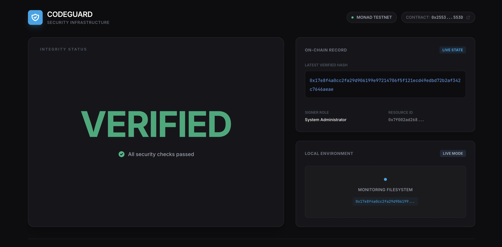

# CodeGuard



CodeGuard is a secure on-chain file integrity logging system deployed on the **Monad Testnet**. It allows agents to commit and verify cryptographic hashes of critical project files (like `package-lock.json`) to ensure supply chain security.

## Project Structure

- `src/`: Smart contract source code (`AgentIntegrityLog.sol`).
- `script/`: Foundry deployment and interaction scripts.
- `frontend/`: React + Vite + Tailwind dashboard for monitoring and manual verification.
- `tasks/`: Node.js helper scripts for CI/CD integration.

## Smart Contract Deployment

To deploy your own instance of the `AgentIntegrityLog` contract to Monad Testnet:

### 1. Prerequisites

- [Foundry](https://book.getfoundry.sh/getting-started/installation) installed.
- A Monad Testnet account with funds (get some from the faucet).

### 2. Set Up a Monad Keystore

CodeGuard never uses a raw private key in `.env`. Instead, deployment and commit tasks sign using an encrypted Foundry keystore plus a password file.

**See [`KEYSTORE.md`](./KEYSTORE.md) for full setup instructions.** Short version:

```bash
# Generate and encrypt a new key into a Foundry keystore
cast wallet import monad-deployer --private-key $(cast wallet new | grep 'Private key:' | awk '{print $3}')

# Save the same password you just chose, for non-interactive script use
echo "YOUR_KEYSTORE_PASSWORD" > ~/.monad-keystore-password
chmod 600 ~/.monad-keystore-password
```

### 3. Configure Public Environment Variables

Create a `.env` file in the root directory containing only non-sensitive configuration parameters:

```bash
CONTRACT_ADDRESS="0x25535A6d53459c5AF12299D44273f4da2184553D"
RPC_URL=https://testnet-rpc.monad.xyz
```

No private key or password ever goes in `.env`.

### 4. Deploy

Deploy your contract using your encrypted keystore account alias:

```bash
forge script script/AgentIntegrityLog.s.sol:DeployIntegrityLog \
  --rpc-url $RPC_URL \
  --broadcast \
  --account monad-deployer
```

Foundry will prompt for the keystore password interactively during deployment.

## Frontend

The dashboard code is located in the `/frontend` directory. It allows you to visualize the integrity logs and manually verify files.

To run the frontend locally:

```bash
cd frontend
npm install
npm run dev
```

Refer to `frontend/README.md` for more details on hashing modes and deployment.

## Integrity Tasks

This project includes automation scripts in the root `package.json` to commit and verify hashes during development or CI:

- **Commit Hash**: `npm run integrity:commit` (Calculates and sends the current project hash to the contract).
- **Verify Hash**: `npm run integrity:verify` (Checks if the local files match the last on-chain checkpoint).

### Configuration for Commit/Verify Tasks

`tasks/commit.js` and `tasks/verify.js` use the following default paths for signing/reading:

- **Keystore**: `~/.foundry/keystores/monad-deployer` (created via `cast wallet import`)
- **Password file**: `~/.monad-keystore-password`

You can override either by setting `MONAD_KEYSTORE_PATH` and `MONAD_KEYSTORE_PASSWORD_FILE` in your `.env` file. See [`KEYSTORE.md`](./KEYSTORE.md) for full setup and troubleshooting.

If no keystore is found, the commit task falls back to a `PRIVATE_KEY` environment variable — this fallback exists for local testing only and should not be relied on for real deployments.

## Roadmap

CodeGuard is evolving to provide even deeper security and better developer experience. Upcoming features include:

- **Full Codebase Hashing**: Support for recursively hashing entire source directories rather than just lockfiles, providing a complete snapshot of project integrity.
- **Hashing Optionality**: Flexible configuration to include/exclude specific files, directories, or patterns (similar to `.gitignore`) when calculating integrity hashes.
- **NPM CLI Interface**: A dedicated command-line interface published to npm (`@codeguard/cli`) to allow developers to easily integrate integrity checks into any project without manual script copying.
- **Multi-Chain Support**: Expanding deployment beyond Monad to other EVM-compatible networks.

## Testing

Run the Solidity test suite:

```bash
forge test
```
